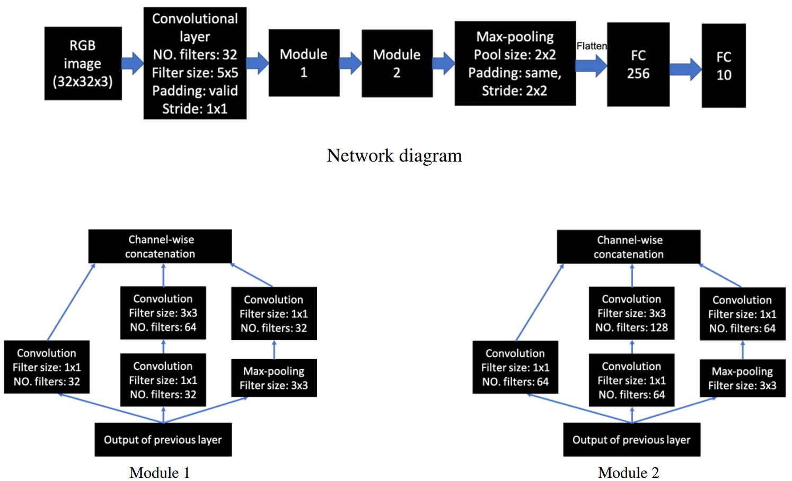
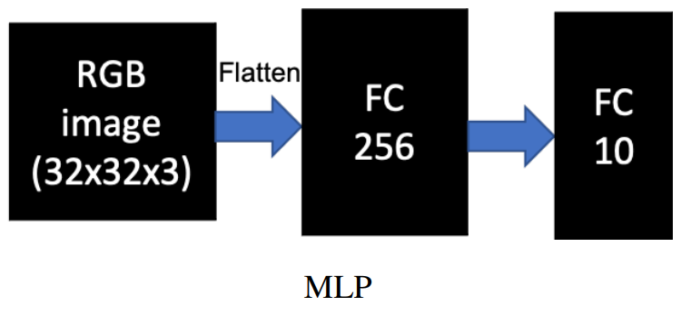

# Image classifiers on the CIFAR 10 subset

## About the project

The purpose of the project is to implement CNN and MLP image classifiers and compare the performance of them on a subset of the CIFAR 10 dataset. 

 

## Datasets

250/200 split subset of CIFAR-10 is loaded from `keras.datasets` for train/test. 

 

## Implemented models 

1. CNN model on raw images

2. MLP model on raw images

  
3. MLP model on extracted features from pre-trained VGG19

    It extracts image features from VGG19 layer `block5_conv4` and uses the representative features. 

4. MLP model on extracted features from pre-trained VGG19 after resizing

    It upscales the original raw images (32x32) into 224x224 before feature extraction.

These models are trained with the same training settings. 

